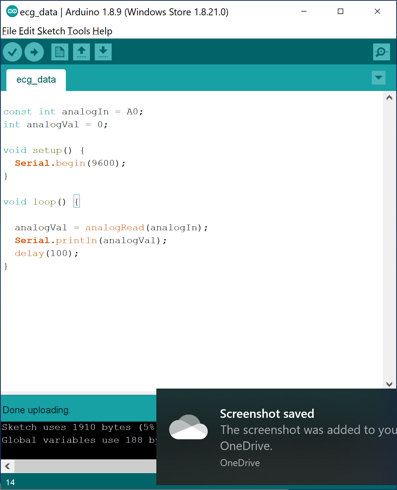
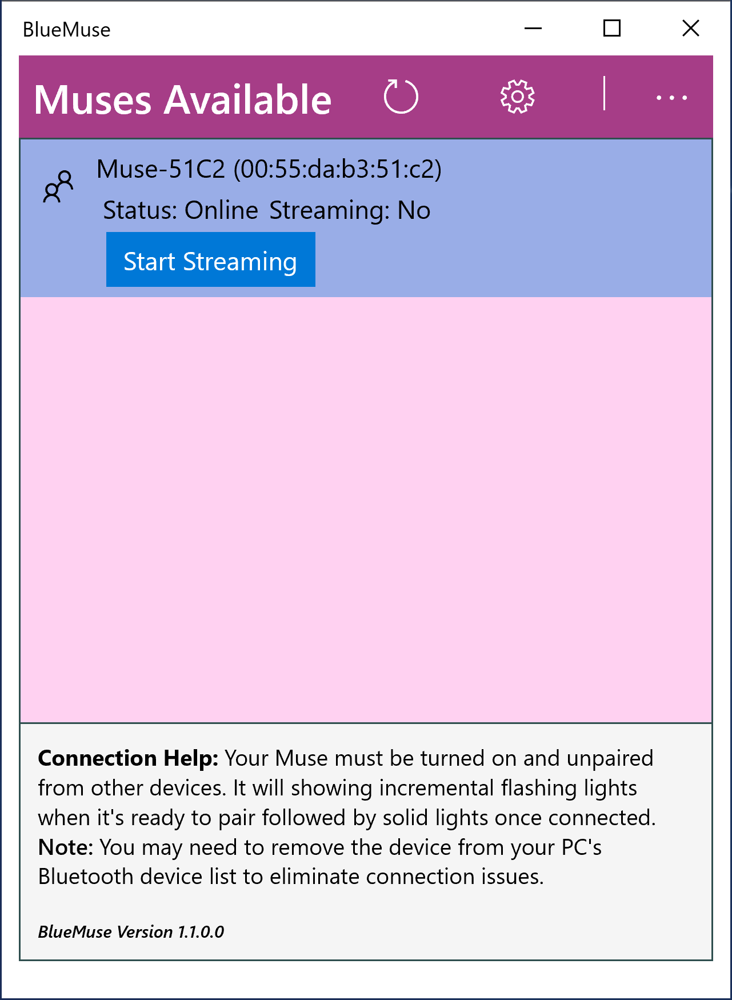

# Heart, Brainwave, and Skin Conductance Sensors

A Variety of physiological sensors to be used with [SSI](https://github.com/hcmlab/ssi). Sensors include the following:

  * **GSR (Galvanic Skin Response)**
    * Refers to changes in sweat gland activity that are reflective of the intensity of our emotional state, otherwise known as emotional arousal.
  * **PPG (Photoplethysmography LED Pulse Sensor)**
    * Uses a light-based technology to sense the rate of blood flow as controlled by the heart’s pumping action
  * **ECG (Electrocardiography)**
    * Measures  the bio-potential generated by electrical signals that control the expansion and contraction of heart chambers
  * **EEG (Electroencephalography)**
    * An electrophysiological monitoring method to record electrical activity of the brain.
  * **EEG with PPG**
  * **EEG with GSR**
  * **EEG with ECG**
  * **EEG with PPG, GSR**
  * **EEG with ECG, GSR**
  * **EEG with PPG, GSR**

### OVERVIEW OF SOFTWARE AND HARDWARE REQUIRED

* **Hardware**: 
  * Arduino Board purchased [here](https://www.arduino.cc/en/Main/Boards) or on [Amazon](https://www.amazon.com/Arduino-A000066-ARDUINO-UNO-R3/dp/B008GRTSV6). 
  * Grove GSR Sensor can be purchased [here](http://wiki.seeedstudio.com/Grove-GSR_Sensor/) or 
  on [Amazon](https://www.amazon.com/NGW-1pc-GSR-sensor-for-Grove/dp/B07B6K3Y7P/ref=asc_df_B07B6K3Y7P/?tag=hyprod-20&linkCode=df0&hvadid=312148136537&hvpos=1o1&hvnetw=g&hvrand=14459081976699628962&hvpone=&hvptwo=&hvqmt=&hvdev=c&hvdvcmdl=&hvlocint=&hvlocphy=9021727&hvtargid=pla-568294557333&psc=1
). 
  * PPG Gravity Heart Rate Monitor Sensor for Arduino purchased [here](https://www.dfrobot.com/product-1540.html).
  * ECG Analog Heart Rator Monitor purchased [here](https://www.dfrobot.com/product-1510.html). 

  * MUSE EEG Headset (2016) Version purchased [here](https://choosemuse.com/). 

* **Software**:  
  * Winsows 10 OS
  * Social Signal Interpretation (SSI) Framework accessed [here](https://github.com/hcmlab/ssi).
    * Installation instructions shown [here](https://rawgit.com/hcmlab/ssi/master/docs/index.html#installation). 
  * Required packages/apps for Muse headset:
    * Muse-LSL: https://github.com/alexandrebarachant/muse-lsl
    * Blue-Muse: https://github.com/kowalej/BlueMuse

### TO RUN:

1. Install SSI on Windows. Follow installation instructions found [here](https://rawgit.com/hcmlab/ssi/master/docs/index.html#installation). 
2. Add the path to the xmlpipe.exe interpreter to your PATH. For me the path is C:\Users\veron\ssi\bin\x64\vc140. 
3. Install Blue Muse Windows 10 app to stream data from Muse EEG headsets via LSL (Lab Streaming Layer)
Go here: https://github.com/kowalej/BlueMuse
4. Install the  Python package for streaming, visualizing, and recording EEG data from the Muse 2016 headband. Go here: https://github.com/alexandrebarachant/muse-lsl
5. Install pyserial (to be used for arduino sensors)
6. Follow the links in the hardware section to get your Arduino hooked up to either the ECG, PPG, or GSR sensors. 
7. Create a small analog input sketch with a baud rate of 9600 as shown in sample below:

8. Upload arduino sketch to the COM port you are using. Note that if you use more than 1 sensor you will use a different COM port. For instance, I used COM 3 and COM 5 on my machine. 
9. Place the Muse headset on your head, ensuring proper fit. 
10. Start the Blue Muse app and click "start streaming" in the GUI as shown below:

11. Enter any .pipeline program into xmlpipe by running xmlpipe {sensor}.pipeline. 

  

### Demo videos:

EEG with PPG, GSR:

EEG with ECG, GSR:
           
